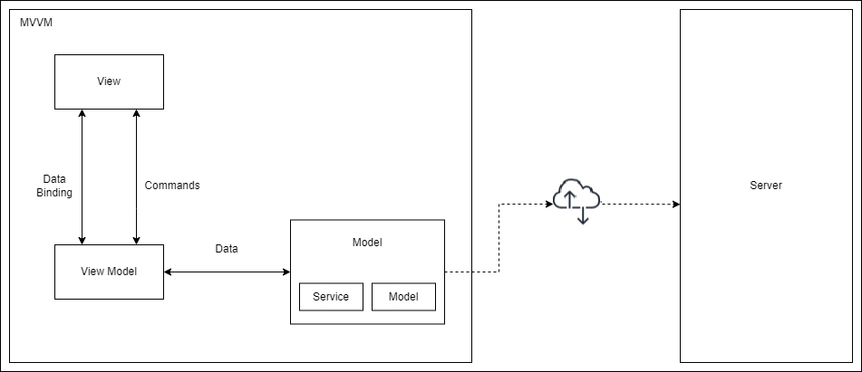
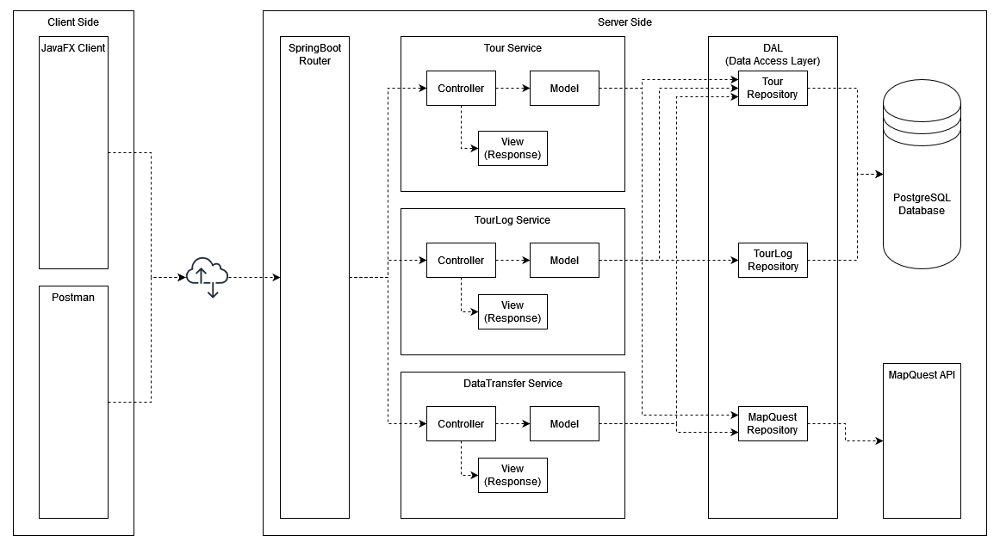
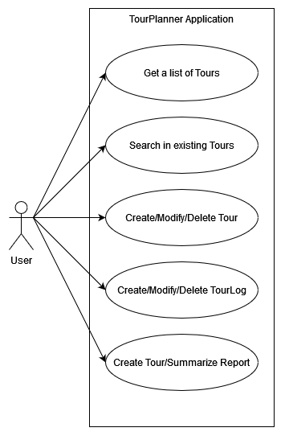
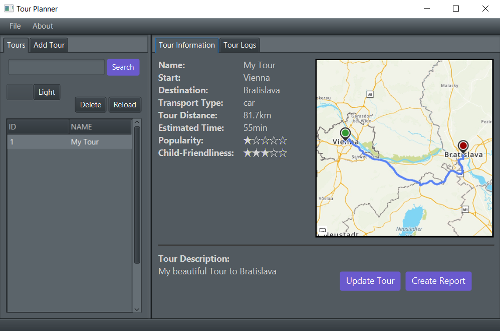

# TourPlanner

A tour planner client/server application written in Java.

Course: SWEN-2, BIF-4\
Work period: April 2023 to June 2023\
Link to GIT: https://github.com/FelixSchuster/TourPlanner

## API Endpoints
The server API endpoints are described in ``./Miscellaneous/openapi.yaml``.\
The file can be viewed using https://editor.swagger.io/.

## App Design

### Client

### Server

## Use Cases

## Library Decisions
- Server: Spring Boot
- UI: JavaFX
- Logging: Log4j
- OR-Mapper: Hibernate
- JSON Parsing: Jackson
- PDF creation: iTextPDF
- Unit Tests: jUnit

## Lessons Learned
- Java is fun
- Drinking beer and programming does not fit well

## Design Patterns
- Repository Pattern
- Model View ViewModel Pattern

## Unit Testing Decisions

During production the code was tested using postman (https://www.postman.com/).\
A configuration file for postman can be found in ``./Miscellaneous/SWEN2.postman_collection.json``.

For more time efficient testing during refactoring a total number of 24 unit tests was added to the server using the JUnit 5 API.\
The unit tests were designed to cover every edge case possible considering the implemented routes.

## UX / Unique Feature
For improved user experience a darkmode was added.

## Tracked Time

### Bea

| Date       | Start Time | End Time | Duration      | 
|:-----------|:-----------|:---------|:--------------|
| 09.05.2023 | 15:00:00   | 18:00:00 | 03:00:00      |
| 11.05.2023 | 10:00:00   | 13:00:00 | 03:00:00      |
| 12.05.2023 | 23:00:00   | 23:59:00 | 00:59:00      |
| 12.05.2023 | 00:00:00   | 05:00:00 | 05:00:00      |
| 13.05.2023 | 10:00:00   | 14:00:00 | 04:00:00      |
| 22.05.2023 | 18:00:00   | 23:59:00 | 05:59:00      |
| 23.05.2023 | 00:00:00   | 02:00:00 | 02:00:00      |
| 25.05.2023 | 17:00:00   | 23:59:00 | 06:59:00      |
| 26.05.2023 | 00:00:00   | 02:00:00 | 02:00:00      |
| 26.05.2023 | 11:00:00   | 14:30:00 | 02:30:00      |
| 26.05.2023 | 16:30:00   | 23:59:00 | 06:29:00      |
| 26.05.2023 | 00:00:00   | 02:00:00 | 02:00:00      |
| 31.05.2023 | 18:00:00   | 22:00:00 | 04:00:00      |
| 04.06.2023 | 17:00:00   | 19:00:00 | 02:00:00      |
| 05.06.2023 | 16:00:00   | 18:00:00 | 02:00:00      |
| 06.05.2023 | 15:00:00   | 17:00:00 | 02:00:00      |
| 07.06.2023 | 23:00:00   | 23:59:00 | 00:59:00      |
| 08.06.2023 | 00:00:00   | 04:30:00 | 04:30:00      |
| 08.06.2023 | 10:00:00   | 04:00:00 | 04:00:00      |
| 08.06.2023 | 15:00:00   | 23:30:00 | 08:30:00      | 
| 09.06.2023 | 12:00:00   | 19:30:00 | 07:30:00      |
| 09.06.2023 | 20:00:00   | 23:59:00 | 03:59:00      |
| 10.06.2023 | 00:00:00   | 03:30:00 | 03:30:00      |
| 10.06.2023 | 12:00:00   | 20:30:00 | 08:30:00      |
| 16.06.2023 | 20:30:00   | 23:59:00 | 03:29:00      |
| 16.06.2023 | 00:30:00   | 04:00:00 | 04:00:00      |
| 18.06.2023 | 22:30:00   | 23:30:00 | 01:30:00      |
| **Sum**    |            |          | **104:30:00** |

### Felix

| Date       | Start Time | End Time | Duration     | Task                                                                                          |
|:-----------|:-----------|:---------|:-------------|:----------------------------------------------------------------------------------------------|
| 24.04.2023 | 13:00:00   | 18:00:00 | 05:00:00     | Setup IntelliJ Project                                                                        |
| 24.04.2023 | 22:00:00   | 23:59:00 | 01:59:00     | Spring Testservice                                                                            |
| 25.04.2023 | 00:00:00   | 00:30:00 | 00:30:00     | Spring Testservice                                                                            |
| 03.05.2023 | 08:30:00   | 11:30:00 | 03:00:00     | Spring Testclient                                                                             |
| 03.05.2023 | 15:00:00   | 16:30:00 | 01:30:00     | API Documentation                                                                             |
| 03.05.2023 | 23:00:00   | 23:59:00 | 00:59:00     | TourPlanner Backend                                                                           |
| 04.05.2023 | 00:00:00   | 03:00:00 | 03:00:00     | TourPlanner Backend                                                                           |
| 04.05.2023 | 10:00:00   | 15:00:00 | 05:00:00     | TourPlanner Backend                                                                           |
| 08.05.2023 | 09:00:00   | 16:00:00 | 07:00:00     | MapQuest Repository                                                                           |
| 10.05.2023 | 21:00:00   | 23:30:00 | 02:30:00     | Import/Export Backend                                                                         |
| 11.05.2023 | 10:00:00   | 13:00:00 | 03:00:00     | Import/Export Backend                                                                         |
| 14.05.2023 | 23:00:00   | 23:59:00 | 00:59:00     | Client RequestSender                                                                          |
| 14.05.2023 | 00:00:00   | 04:00:00 | 04:00:00     | Client RequestSender, ImageHandler, JsonFileHandler                                           |
| 14.05.2023 | 11:00:00   | 15:30:00 | 04:30:00     | Mockups                                                                                       |
| 17.05.2023 | 20:00:00   | 23:59:00 | 03:59:00     | Add search feature, fix delete, add services to client, add automatically computed attributes |
| 18.05.2023 | 00:00:00   | 02:00:00 | 02:00:00     | Add pdfHandler                                                                                |
| 23.05.2023 | 16:00:00   | 17:00:00 | 01:00:00     | Minor improvements                                                                            |
| 23.05.2023 | 18:30:00   | 23:59:00 | 05:29:00     | Update pdfHandler                                                                             |
| 24.05.2023 | 00:00:00   | 01:30:00 | 01:30:00     | Update pdfHandler                                                                             |
| 24.05.2023 | 09:00:00   | 13:30:00 | 04:30:00     | Add logger to server                                                                          |
| 24.05.2023 | 19:00:00   | 21:00:00 | 02:00:00     | Fix import                                                                                    |
| 25.05.2023 | 12:00:00   | 15:30:00 | 03:30:00     | Add logger to client, add proper error messages, update documentation                         |
| 16.06.2023 | 20:00:00   | 20:30:00 | 00:30:00     | Fix 'Invalid Value for SecondOfDay' error, limit tour distance to two decimal places          |
| 16.06.2023 | 20:31:00   | 23:59:00 | 03:28:00     | Add unit tests, update documentation                                                          |
| 17.06.2023 | 00:00:00   | 02:00:00 | 02:00:00     | Update documentation                                                                          |
| **Sum**    |            |          | **72:53:00** |                                                                                               |

